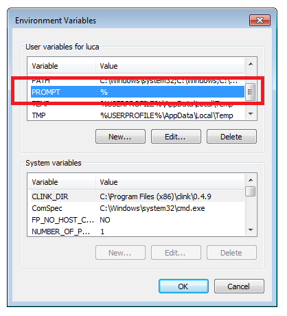
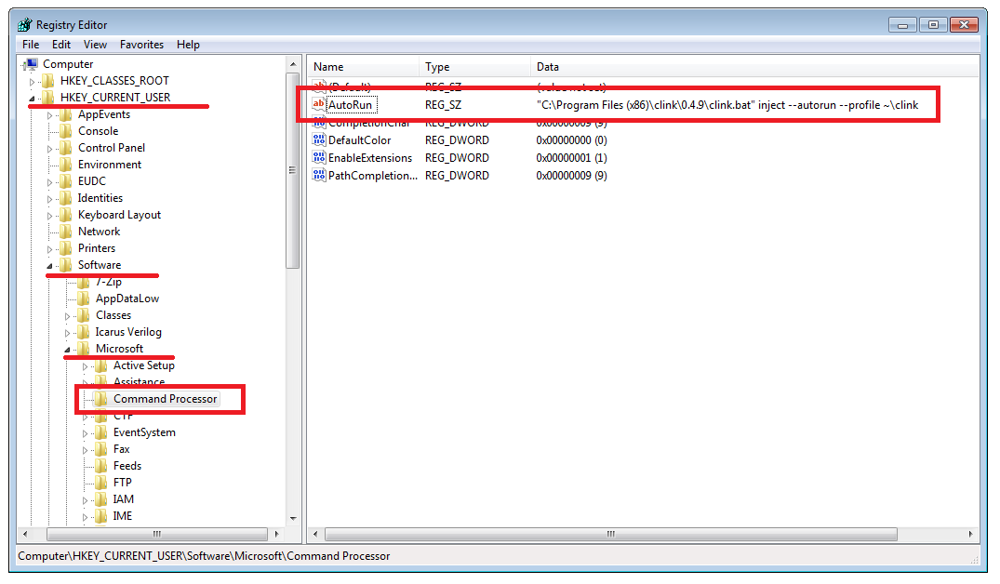
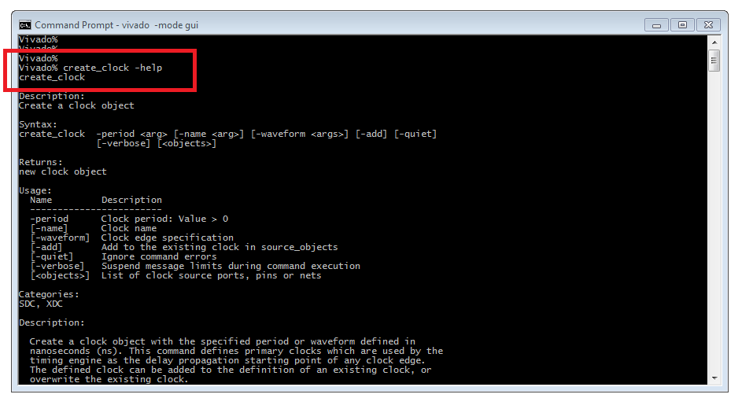
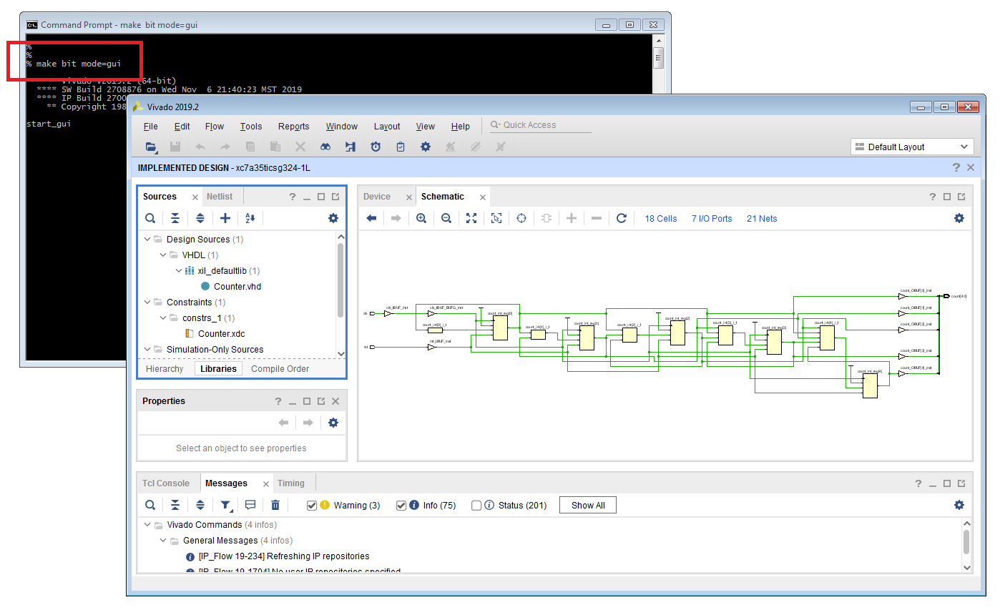

# Setting up the Xilinx Vivado development environment </br> for Linux/Windows operating systems

# Contents

* [**Introduction**](#introduction)
* [**Installing Xilinx Vivado**](#installing-xilinx-vivado)
* [**Command line usage**](#command-line-usage)
* [**Text editor**](#text-editor)
* [**Additional installations and configurations for Windows users**](#additional-installations-and-configurations-for-windows-users)
   * [**Improve the Windows Command Prompt appearance**](#improve-the-windows-command-prompt-appearance)
   * [**Install a Linux-like TAB completion**](#install-a-linux-like-tab-completion)
   * [**Enable file extensions visualization**](#enable-file-extensions-visualization)
   * [**Add a login script for the Command Prompt**](#add-a-login-script-for-the-command-prompt)
   * [**Add Notepad++ executable to search path**](#add-notepad-executable-to-search-path)
   * [**Add Linux executables to search path**](#add-linux-executables-to-search-path)
* [**Install Git**](#install-git)
* [**Install Tcl**](#install-tcl)
* [**Add Xilinx Vivado executables to search path**](#add-xilinx-vivado-executables-to-search-path)
* [**Clone and update the Git repository for the course**](#clone-and-update-the-git-repository-for-the-course)
* [**Sample Xilinx Vivado simulation and implementation flows**](#sample-xilinx-vivado-simulation-and-implementation-flows)
   * [**Run a digital simulation using XSim**](#run-a-digital-simulation-using-xsim)
   * [**Implement the design on a target FPGA**](#implement-the-design-on-a-target-fpga)

<!--------------------------------------------------------------------->
# Introduction
[**[Contents]**](#contents)

These short notes in form of step-by-step instructions are meant to help students
to setup a suitable development environment for FPGA programming using the Xilinx Vivado suite.

Please, be aware that **Xilinx _only_ supports Linux and Windows platforms**, not MacOS.
Students using a MacOS personal computer must either install
a supported operating system (Linux Ubuntu would be preferable)
using a virtualization software (e.g. VirtualBox)
or find another computer running a Linux distribution or Windows 7/10.

In the course we will also work at the command-line assuming a **Linux-like development environment**.
Familiarity with Linux basic shell commands, with the GNU Makefile and with a text editor
is therefore assumed.
Additional information regarding how to setup a suitable Linux-like development environment under Windows
are provided to support Windows users.

<hr>

**IMPORTANT !**

> Most of screenshots included in this guide are mainly from a _Windows 7 Ultimate_ operating system. 
> Small differences can arise from Windows 7 and Windows 10.
> Additionally, screenshots referring Xilinx Vivado installation steps are from a **2019.2 installer**. The content of the wizard for
> the latest version **2020.1** available for download on the Xilinx website can be slighty different.

<hr>


# Installing Xilinx Vivado
[**[Contents]**](#contents)

The software used in the course is called **Xilinx Vivado**. It is a professional and complete
CAD suite to program Field Programmable Gate Array (FPGA) devices from Xilinx using industry-standard
Hardware Description Languages (HDL) such as Verilog and VHDL. As requested by most of students we will
use VHDL in the course.

As part of the suite Vivado also provides a good **digital simulator** called **XSim** that will be used
in the course to implement and simulate our digital designs using VHDL.

Despite many other professional digital simulators exists on the market (e.g. ModelSim) the goal of the course is
mainly to introduce FPGA programming fundamentals targeting Xilinx devices, therefore installing this software is mandatory.
Additionally, XSim supports the simulation of mixed-language designs without the need of a commercial license.

The software can be downloaded free of charge from the official Xilinx website :

<https://www.xilinx.com/support/download.html>

The package to be downloaded is called **Vivado Design Suite - HLx Editions**. As already mentioned the software is
available **_only_ for Linux and Windows operating systems**. Both Windows 7 and Windows 10 are supported.
In order to download the software and to obtain a free license you must **register and create an account** on the Xilinx website.

At the time of writing the latest version of the software available on the site is **2020.1**.
An older **2019.2** version is also available. Unless special requirements in your research work (e.g. backward compatibility
with some old FPGA board) it is always recommended to install and use the latest available version of the software,
but if you already installed Xilinx Vivado **any older version of the tool will be fine for the course**.
It is also recommended to download the file called **Vivado HLx 2020.1: All OS installer Single-File Download**.
In fact many times splitted downloads or downloads using the installers just gave troubles.<br/>
Please, be aware that the file to be downloaded is **extremely huge** (approx. 35 GB) due to the increasing
support for new complex devices. Indeed, the final installation will consume less disk space.


At the end of the download process you will have a single compressed tar file with extension `.tar.gz`.
Linux users can easily extract the file at the command line with the usual `tar` command :

```
% cd /path/to/download/directory
% tar -xzf  Xilinx_Vivado_<version>.tar.gz
```

Very likely Windows users will have to install a dedicated program in order to extract `.tar.gz` files.<br/>
If not already available on your system you can download and install **7-zip** for this purpose :

<https://www.7-zip.org>

Once the extraction process is completed you will find the main **installation executable**
in the extracted directory :

* `xsetup` for Linux
* `xsetup.exe` for Windows


Linux users can start the installation process from the command line as follows :

```
% cd Xilinx_Vivado_<version>
% chmod +x xsetup
% sudo ./xsetup
```

Windows users can start the installation process by running as administrator the `xsetup.exe` executable instead.


Most important installation steps are :

* accept all license agreements
* select software packages to be installed
* select supported devices
* select a top installation directory
* obtain a free license


As a first step you have to accept all license agreements :


After accepting all license agreements you are requested to choose software packages to be installed.
Despite there are no drawbacks in installing the complete Xilinx suite, called **Vivado HL System Edition**,
in order to **reduce the consumed disk space** it is recommended to select the **Vivado HL WebPACK** :


For the same reason, if you want to save disk space it is recommended to **not install**
libraries for very advanced and complex FPGA devices. In particular you can **deselect**
all **SoC**  and **UltraScale** devices, leaving the check only on the **7-Series** entry
(during the course we will refer to an Artix-7 device in fact) :


Finally, in the **choice of the installation directory** it is highly recommended to **avoid paths containing empty spaces**.
The default path proposed by the wizard is :

* `/opt/Xilinx` for Linux
* `C:\Xilinx` for Windows

If you do not have special requirements you can leave the default value. Indeed, for **Windows users**
it is highly recommended to **change the default path** and install Xilinx Vivado in the **data-partition** `D:\`
if available (e.g. `D:\Xilinx`) without cluttering the system partition `C:\` with several GB of additional software.


At the end of the installation process you will be automatically redirected to the Xilinx website to 
**obtain and install a free license**.


# Command line usage
[**[Contents]**](#contents)

The approach adopted in this FPGA programming course will be **script-based** and **command-line based**
assuming a **Linux-like development environment**. That is, we will run all Xilinx Vivado flows from the command-line.
All students are therefore requested to have some familiarity with **Linux basic shell commands** to work with files and
directories (`cd`, `pwd`, `mv`, `mkdir`, `rm` etc.), with the **GNU Makefile** (`make`) and with a **text editor**.
Additionally, as described later in the guide we will use Git to keep track of the code presented in this course.

Students working with a Linux operating system must be therefore able to open a "shell" application.
As an example, on Ubuntu distributions the so called _Terminal_ can be launched from
_Applications > Accessories > Terminal_ .

Students working on a Windows operating system will use the _Command Prompt_ application instead.
On both Windows 7 and Windows 10 this application can be launched by typing "prompt" in the search function
of the _Start_ menu, or from _Start > All Programs > Accessories > Command Prompt_ .

Unfortunately the Windows command line requires several improvements and installations in order to be used as
a profitable tool for FPGA programming. Detailed instructions are therefore part of this guide to help Windows users to
install and configure all additional components required to run Xilinx Vivado flows from the command-line.


# Text editor
[**[Contents]**](#contents)

During the course we will write and discuss a lot of source code in form of plain-text files
(VHDL sources, XDC constraints, Tcl scripts, GNU Makefiles etc.).

Familiarity with a good **text editor** is therefore assumed for the course.
Despite the choice is completely up to students, for those that are not already familiar with
programming it is recommended to use :

* **Gedit** for Linux
* **Notepad++** for Windows

**Gedit** is the default text editor on many Linux distributions. You can check if it is already installed
on your system by opening a terminal and typing :

```
% which gedit
```

Usually the output of the command is `/usr/bin/gedit`. To open a source file the syntax will be always in form of :

```
% gedit filename.txt &
```

Do not forget to add the ampersand `&` at the end of the command to launch the executable in background and
leave the shell active.<br/>
Many other good text editors exists under Linux, e.g. Emacs, Atom, `nano` or `vim`.
Feel free to use your preferred application.

For Windows users an excellent text editor is **Notepad++** instead. It can be freely downloaded and installed from :

<https://notepad-plus-plus.org/downloads>


Despite Windows natively provides **Notepad** in fact, **Notepad++** is foreseen for programming
and offers additional features such as syntax highlighting, line numbering and automated code indentation.<br/>
Later in the text we will see how to use it effectively **also from the Windows command-line**.


# Additional installations and configurations for Windows users
[**[Contents]**](#contents)

This section contains detailed instructions for **Windows users** to improve the _Command Prompt_
environment for an effective usage. Students working with a Linux system can skip these details and move to
[**Install Git*](#install-git) instead.<br/>


## Improve the Windows Command Prompt appearance
[**[Contents]**](#contents)

If you never used the Windows command prompt before, the first time you open it you will find
a very uncomfortable and terrifying environment, starting from nasty default fonts.

As a first step it is therefore recommended to **change default font and font size** in order to
**improve the readability**. To do this, right-click on the title bar of the command window and select the _Font_ TAB.
A choice that immediately improves the overall appearance is _Lucida Console_ with a font size 12 :


You can also easily change the "prompt string". This can be done through the `PROMPT` reserved environment variable.
By default the prompt string displays the full-path of the current working directory, but you can customize this behaviour.
To make changes persistent you must set the `PROMPT` variable through the _Edit environment variables for your account_
graphical interface (type `env` in the search entry of the _Start_ menu). Type `prompt /?` at the command line to get
the complete list of supported special placeholders to set the prompt string.




## Install a Linux-like TAB completion
[**[Contents]**](#contents)

Without doubts another frustrating aspect of the original Windows command line is the lack of an efficient **TAB completion**
as the Linux one (based on the C GNU Readline libraries) in order to automatically complete partially-typed commands and expressions
using the TAB key. By default the native Windows _Command Prompt_ in fact only supports the TAB completion on directories paths, but not
for command executables.

As an example, if you open the _Command Prompt_ and you start writing

```
% note <TAB>
```

and then you press the TAB key you will immediately realize that the expression is not automatically completed into
`notepad.exe`, which is the name of the Notepad executable.

Indeed a **port for Windows** of the TAB completion implemented for the Linux Bash shell exists and comes with a free
program called **Clink** :

<https://mridgers.github.io/clink>

For a **more efficient usage of the Windows command line** it is therefore **highly recommended**
to download and install this tiny executable :

<https://github.com/mridgers/clink/releases/download/0.4.9/clink\_0.4.9\_setup.exe>

At the end of the installation process a new `AutoRun` variable is created for your account by the installer
in the **Windows Registry Editor** (`regedit.exe`) as


`HKEY_CURRENT_USER > Software > Microsoft > Command Processor > AutoRun`

starting the `clink` executable for you each time a _Command Prompt_ instance is launched.





If the installation process completed successfully, the next time you will open a new
terminal windows you will see a banner with copyright information indicating that
the TAB completion has been added to the command interpreter :


If you are a more experienced Windows user you can also choose to download and extract somewhere the `.zip`
without performing any installation that requires elevated privileges. However, with this choice you will
have to create the `AutoRun` variable in the  _Registry Editor_ by hand to "inject" clink each time a new
_Command Prompt_ is started.
A more effective solution to collect such kind of customizations and extensions is to **use a login script**, as described later in this guide.

If you later want to **suppress the annoying copyright banner** you can simply edit the


`HKEY_CURRENT_USER > Software > Microsoft > Command Processor > AutoRun`

variable in the _Registry Editor_ and redirect the output of the `clink` executable to `nul` :


## Enable file extensions visualization
[**[Contents]**](#contents)

Another frustrating aspect when we deal with programming and coding on a Windows operating
system is the fact that by default **most of file extensions are hidden to the user**.

As an example, a text file created under Linux named `README.txt` and then copied on a Windows system
by default will be displayed as `README`, hiding the fact that it is a text file (`.txt`) in the displayed file name.
On the contrary, the same text file created under Linux but simply named `README` without extension
will be not recognized by Notepad (the default text editor on any Windows system) and you will not be able to open it
with a double-click on the file icon.

This behaviour arises from the fact that file extensions under Windows are important because
they are used by the operating system to know which programs have to be used to open the files, while on a Linux
system the file extension has no particular importance, but helps the user to easily recognize the type
of the file.

Things only get worse when you install new programs registering somehow "new" file extensions for the operating
system. As an example, a simple text file containing some experimental measurements and named `data.dat`
will be recognized as an LTspice after installing LTspice and registering (either consciously during the installation or not)
the `.dat` extension to the operating system.

As a result it becomes very important to fix this and **enable the visualization of file extensions** for all files,
making the system more similar to a Linux system. This can be easily done from any window of the file browser _Explorer_

On Windows 7 navigate through _Organize > Folder and search options > View_ and **disable**
the option _Hide extensions for know file types_.

On Windows 10 use _View > Options > Change folder and search options_ instead.


## Add a login script for the Command Prompt
[**[Contents]**](#contents)


A final additional frustrating aspect when we try to work effectively with the Windows
command line is the lack (by default) of a **login script** executed when an instance
of the _Command Prompt_ is launched.<br/>

On the contrary this feature is natively supported by all Linux shells.
For instance, if a file named `.bashrc` exists in the
**user's home directory** on a Linux system it is executed each time a **Bash shell** is invoked.

The possibility to execute some kind of initialization script also for the _Command Prompt_
becomes very useful to **add customizations, extensions** etc. to the command line environment.
As an example, we can **add executables to the search path** (e.g. Notepad++, Xilinx tools)
such that they can be directly invoked from the command interpreter at any time.

In order to add this feature to the Windows terminal we can either :

* use the `AutoRun` variable in the Windows _Registry Editor_ or
* modify the **shortcut** used to launch the _Command Prompt_


Creating/editing entries in the main _Registry Editor_ of a
Windows system is **NOT RECOMMENDED for non-experienced users**. The second option
is safer, faster and easier for any user, thus will be adopted for the course.

When you invoke the _Command Prompt_ from the _Start_ menu in fact,
you are just executing a Windows **shortcut application** created for the actual
shell executable `C:\Windows\System32\cmd.exe`. You can therefore easily
**modify shortcut properties** in order to force `cmd.exe` to also execute a script at startup.

For this purpose, locate the _Command Prompt_ on your system
and **right-click** on it instead of launching the application. This allows you to edit the
shortcut _Properties_. In particular, select the _Shortcut_ TAB.

The default value in the _Target_ entry should be :

```
%windir%\System32\cmd.exe
```


In order to force the `cmd.exe` executable to load a script at startup simply edit the _Target_ entry as follows :

```
%windir%\System32\cmd.exe /K %USERPROFILE%\login.bat
```

The additional `/K` option in fact executes the `%USERPROFILE%\login.bat` script (if exists)
each time the _Command Prompt_ shortcut is launched, similarly to what happens in the Linux Bash shell with the `.bashrc`.
As you might expect the `USERPROFILE` environment variable is the Windows equivalent for `HOME` in Linux
and locates the user's home directory on the system, usually `C:\Users\username`.

You can also force the _Command Prompt_ to always start in your home directory. This is already the
default behaviour, but for better readability you can replace `%HOMEDRIVE%%HOMEPATH%` with a simpler
`%USERPROFILE%` in the _Start in_ entry. Left-click on _Apply_ and then _OK_ when done.


At this point we can finally **create our new login script** `login.bat` in the home directory
and start adding customizations. For this purpose we will start using the default text editor Notepad.

Open a new _Command Prompt_ and type :

```
% notepad login.bat
```

The `.bat` extension is mandatory and the code added to the file must be written following
the syntax of the **Windows Batch scripting language**.

As a first step try to write these lines of code :

```
:: login script

@echo off

echo.
echo Loading %USERPROFILE%\login.bat
echo.
```


Save and close Notepad when done. In order to check your new setup, close also
the _Command Prompt_ and open a new one. If everything has been properly configured you will see
that the `login.bat` script is loaded at startup. You will also see the Clink banner if you already installed it.


## Add Notepad++ executable to search path
[**[Contents]**](#contents)

After all improvements made to the Windows command line we can
start using this tool more efficiently. Additional customization or
extension for the command line environment can be added to the `login.bat`
initialization script automatically executed when the _Command Prompt_ is launched.

As a first example we can add the Notepad++ executable to the Windows
search path such that it can be invoked from the command line.

In order to do this we have to **extend the system search path**,
that is the list of directories in which executables and scripts
Are searched when invoked at the command line.<br/>

As on Linux systems, also Windows uses the `PATH` environment variable
for this purpose. We can use Notepad to edit the `login.bat` script
and update the `PATH` environment variable by adding also the directory containing
the Notepad++ executable, called `notepad++.exe`.

Please **add and customize** the following statements in the newly created `login.bat` using Notepad :

```
:: include Notepad++ executable to search path
set PATH=\path\to\Notepad++\installation\directory;%PATH%
```

As an example, if you decided to install Notepad++ in `D:\local\Notepad++\x86_64` the syntax will be :

```
set PATH=D:\local\Notepad++\x86_64;%PATH%
```


Do not forget to always save the file after new modifications.
You can also **reload the content of the script** without the need of
close/reopen the terminal. You can use in fact the `call` command, which is
the Windows equivalent of the `source` command on Linux systems :

```
% call login.bat
```


Once the search path has been updated you can verify that the `notepad++.exe` executable
is found on the system using the `where` command (the Windows equivalent of the `which`
command on Linux systems) :

```
% where notepad++
```

Finally try to open a text file using Notepad++ from the command line :

```
% notepad++ login.bat
```


Since the name of the executable is quite long, for **less and faster tying** at the
command line we can also create a simpler **alias** e.g. `n++` in place of the longer `notepad++`
using the `doskey` command (the Windows equivalent of the `alias` command on Linux systems).

For this purpose, add the following code to the `login.bat` script :

```
:: create a shorter alias (doskey) for notepad++.exe for faster typing
doskey n++=notepad++.exe $*
```

Save the file and reload the script at the command line with the `call` command to apply your changes :

```
% call login.bat
```

At this point we have a **very good text editor** for programming that we can also use efficiently from the
Windows _Command Prompt_ :

```
% n++ counter.vhd
```


You can notice that Notepad++ properly recognizes the language from the extension of the source file
(Batch file for `login.bat`, VHDL for `counter.vhd`).

In the following section we discuss how to use `login.bat` to **add also Linux executables**
to the Windows command line.


## Add Linux executables to search path
[**[Contents]**](#contents)

This introductory FPGA programming course will
be script-based and command-line based. We will run all Xilinx Vivado flows
from the command-line assuming a Linux-like development environment.<br/>
There are no drawbacks in using Windows native shell commands to run
the flows with this approach and Xilinx extensively supports both Linux and Windows scripting
environments with no preference.<br/>
However for teaching purposes it becomes essential to minimize differences between
Linux and Windows operating systems, providing flows that can run seamless on both platforms.

As a result we must be able to use basic Linux commands from the Linux Bash shell
also under Windows.

There are many different software solutions for this, most popular are :

* **Cygwin**  : <https://www.cygwin.com>
* **WinBash** : <http://win-bash.sourceforge.net>
* **GNU Win** : <http://gnuwin32.sourceforge.net>
* **MinGW**   : <http://www.mingw.org>


If installed, the Cygwin package provides a very large collection of Linux commands and programs
that can be invoked from the Windows command line, from very basic commands such as `ls`, `pwd` etc.
up to `gcc/g++` compilers along with C/C++ libraries and sources or advanced networking commands.

The other software solutions offer smaller collections of Linux executables, foreseen to provide
a basic Linux-like environment on Windows.

For this course we will use the **GNU Win** package. Despite you can download and
install the package from the official website it is **highly recommended**
to download the following `.zip` file instead :

<http://personalpages.to.infn.it/~pacher/didattica/dottorato/FPGA/software/GnuWin.zip>

The main reason for this is that the proposed `.zip` file contains fully verified executables on both
Windows 7 and Windows 10 systems. Some commands from other installations showed in the past different behaviours
from version 7 to version 10.

Download and extract the `.zip` file in some meaningful place on your machine.
Once the extraction process is completed you will
find all Linux executables in the `GnuWin\bin` directory.

In order to invoke these executables from the Windows _Command Prompt_ we have to update
the search path to include in the `PATH` environment variable also the `GnuWin\bin` directory.

Please **add and customize** the following code to the `login.bat` :


```
:: add GNU Win executables to search path
set PATH=\path\to\GnuWin\bin;%PATH%
```

As an example, if you extracted the file in `D:\local` the syntax will be :

```
set PATH=D:\local\GnuWin\bin;%PATH%
```

Additionally we must prevent **name clashes** between native Windows executables and Linux executables.
As an example, `mkdir` is a Windows built-in command, but we want to be sure that `GnuWin\bin\mkdir.exe`
is used instead. To force the _Command Prompt_ to search built-in executables in `PATH`
we have to create doskeys for those Linux commands that also exists in Windows with the same name.

Please **add the following statements** to your `login.bat` script :

```
:: force the Command Prompt to search built-in executables in PATH
doskey mkdir="mkdir.exe" $*
doskey mkdir="rmdir.exe" $*
doskey echo="echo.exe" $*
doskey more="more.exe" $*
```

Ref. also to :

<https://superuser.com/questions/1253369/gnuwin32-makefile-mkdir-p>


Save and reload the `login.bat` script once done :

```
% call login.bat
```

At this point we can use basic Linux commands such as `ls`, `pwd`, `which` etc. also
from the Windows command interpreter.

Try the following commands to check that the new environment is properly configured :


```
% cd Desktop
% pwd
% mkdir -p test/bin
% touch test/README
% ls -l test/
% rm -rf test/
% which mspaint
```


You can also define additional UNIX-like doskeys for the `ls` to enable coloring etc.

A complete example of `login.bat` can be found in the `sample/` directory
at the top of the Git repository.


# Install Git
[**[Contents]**](#contents)

Most of the material for the course will be **tracked using the Git versioning tool**.
All students are therefore **requested to have a working Git installation** to clone the
repository and get updates.

Usually `git` is already installed by default on most Linux distributions.
Verify that `git` is found in your search path with :

```
% which git
```

In case the Git package is not installed on your Linux system, use

```
% sudo yum install git
```

or

```
% sudo apt-get install git
```
<br/>

Students working on a Windows system instead can download and install **Git for Windows**
from the project official page :

<https://gitforwindows.org>

By default the automated installer already updates the `PATH` environment variable and adds
the `git` executables to the search path for you. At the end of the installation
open a _Command Prompt_ and check if the `git` command is found in the search path :

```
% which git
```

If you choose in the installation wizard to skip to automatically modify the `PATH` environment variable
you can later update the search path in the `login.bat` as follows :

```
:: add git executable to search path
set PATH=\path\to\Git\cmd;%PATH%
```

Once done, save and reload the `login.bat` script and check if the `git` executable is available
from the command line :

```
% call login.bat
% which git
```

Indeed, if you prefer a non-administrator installation a `.zip` file (approx. 280 MB) has been already
prepared for you and is available at :

<http://personalpages.to.infn.it/~pacher/didattica/dottorato/FPGA/software/git4windows.zip>

Download and extract the file in some meaningful place on your machine and then
update the search path in the `login.bat` script to include the `git4windows/cmd`
directory in the `PATH` environment variable :

```
:: add git executable to search path
set PATH=\path\to\git4windows\cmd;%PATH%
```

Further instructions regarding how to configure Git for the first time and to download
the repository are given [**later in this guide**](#clone-and-update-the-git-repository-for-the-course).


# Install Tcl
[**[Contents]**](#contents)


The **Tool Command Language (Tcl)** is the scripting language officially
supported by Xilinx Vivado. We will also use Tcl to make all flows **platform-independent**
and **portable between Linux and Windows operating systems**. For this purpose, the Tcl shell
executable `tclsh` must be available at the command line.

Usually `tclsh` is already installed by default on most Linux distributions. Verify that `tclsh`
is found in your search path :

```
% which tclsh
```

In case the Tcl package is not installed on your Linux system, use

```
% sudo yum install tcl
```

or

```
% sudo apt-get install tcl
```
<br/>

Students working on a Windows system are requested to install this additional software too.

You can download and install **Tcl for Windows** from different online sources. We recommend
to use the [**WinTclTk package**](http://wintcltk.sourceforge.net) from _sourceforge.net_.

As already done for the GNU Win package, if you prefer a non-administrator installation
a `.zip` file has been prepared for you and is available at :

<http://personalpages.to.infn.it/~pacher/didattica/dottorato/FPGA/software/WinTclTk.zip>

Download and extract the file in some meaningful place on your machine and then
update the search path in the `login.bat` script to include the `WinTclTk/bin`
directory in the `PATH` environment variable :

```
:: add tclsh executable to search path
set PATH=\path\to\WinTclTk\bin;%PATH%
```

As an example, if you extracted the file in `D:\local` the syntax will be :

```
set PATH=D:\local\WinTclTk\bin;%PATH%
```

Once done, save and reload the `login.bat` script and check if the `tclsh` executable is available
from the command line :

```
% call login.bat
% which tclsh
```

Additionally, if a `tclshrc.tcl` (`.tclshrc` on Linux) init script is found in the user home directory `%USERPROFILE%`
(`$HOME` on Linux) it will be executed each time you invoke the `tclsh` executable.

A sample init file `sample/tclshrc.tcl` (`sample/.tclshrc` for Linux) is part of this repository
and can be used as a starting point to collect user's customizations.

Copy this file in your home directory `%USERPROFILE%` (or `$HOME` for Linux)


```
% cp ../../sample/.tclshrc     $HOME               (for Linux users)
% cp ../../sample/tclshrc.tcl  %USERPROFILE%       (for Windows users)
```

and try to launch a `tclsh` session :

```
% tclsh
```

If everything is properly configured the console prompt will change as follows :


```
% tclsh
Tcl version 8.5

Loading C:\Users\username\tclshrc.tcl

tclsh$
```

Type `exit` to quit the `tclsh` session :

```
tclsh$ exit
```


# Add Xilinx Vivado executables to search path
[**[Contents]**](#contents)

At the end of the Xilinx Vivado installation it is possible that a shortcut has been created
on your desktop, along with a new entry in the programs menu.

Additionally, in order to **invoke Vivado executables from the command line** we must include a certain number of
installation directories in the `PATH` environment variable of the operating system.<br/>
The Vivado installation **already provides initialization scripts** for both Linux and Windows
for this purpose. The only thing to do is to add a `source` (Linux) or `call` (Windows) statement to
`.bashrc` (Linux) and `login.bat` (Windows) login scripts respectively.

In the following we assume that a `XILINX_DIR` environment variable will be used to locate
the main installation directory specified during the Vivado installation process.

For Linux users, please **add and customize** the following statements in the home `.bashrc` with your preferred text editor :

```
# variable to locate the main Xilinx installation directory
export XILINX_DIR=/path/to/Xilinx/main/installation/directory
```

As an example, if you decided to install the software in `/opt/Xilinx` (default) you will use :

```
export XILINX_DIR=/opt/Xilinx
```

For Windows users instead, please **add and customize** the following statements in the `login.bat` using Notepad++ :

```
:: variable to locate the main Xilinx installation directory
set XILINX_DIR=\path\to\Xilinx\main\installation\directory
```

As an example, if you decided to install the software in `C:\Xilinx` (default) you will use :

```
set XILINX_DIR=C:\Xilinx
```

At this point there is no more difference between Linux and Windows operating systems because the tree of directories
that comes after the installation is the same on both operating systems. In particular the main directory containing
Vivado will be accessible as :

* `$XILINX_DIR/Vivado/<version>` on Linux
* `%XILINX_DIR%\Vivado\<version>` on Windows

Inside the `XILINX_DIR/Vivado/<version>` directory you will find two initialization scripts :

* `settings64.sh` for Linux
* `settings64.bat` for Windows


If executed in a command line these scripts update the `PATH` environment variable and add
all required Vivado executables to the system search path.
In order to have all Vivado executables when a new terminal is invoked, just `source` (Linux) or `call` (Windows)
the proper script in the main login script.

For Linux users, please **add and customize** the following `source` statement in your home `.bashrc` :

```
# add Vivado executables to search path
source $XILINX_DIR/Vivado/<version>/settings64.sh
```


For Windows users instead, please **add and customize** the following `call` statement in your `login.bat` :

```
:: add Vivado executables to search path
call %XILINX_DIR%\Vivado\<version>\settings64.bat
```


As an example, if you installed the latest 2019.2 version :

```
source $XILINX_DIR/Vivado/2019.2/settings64.sh    (Linux)
call %XILINX_DIR%\Vivado\2019.2\settings64.bat    (Windows)
```

At this point each time you will open a new terminal `settings64.sh` (Linux) or `settings64.bat` (Windows)
will be automatically executed and Vivado executables will be available from the command line.

In order to **test your Xilinx Vivado installation**, please try to observe the output of the following commands :


```
% which vivado
% vivado -help
% which xvhdl
% xvhdl -help
% xsim -help
```


Try to open the Vivado **graphic user interface (GUI)** from the command line after creating a dedicated test directory :

```
% cd Desktop
% mkdir test 
% cd test
% vivado -mode gui
```


Close the Vivado main startup window by typing `stop_gui` followed by a RETURN
in the **Vivado Tcl console** placed at the bottom-left of the startup window (you can also find the hint _Type a Tcl command here_) :


At this point you are using Vivado in the so called **interactive mode (Tcl-mode)**. The prompt of the command line
has changed and now is the Vivado prompt, where you can issue Vivado-specific commands :

```
Vivado%
```


Issue the following command at the Vivado command prompt and observe the output :

```
Vivado% create_clock -help
```




Exit from the Vivado Tcl console :

```
Vivado% exit
```

Remove the temporary directory that you created for this test :

```
% pwd
% cd ..
% rm -rf test/
```

# Clone and update the Git repository for the course
[**[Contents]**](#contents)

The source code for the course is hosted on GitHub :

<https://github.com/lpacher/fphd>

All students are requested to use `git` to **download the repository**
and to **keep track of updates**.

In case `git` is not already installed on the system, Linux users can use :

```
% sudo yum install git
```

or

```
% sudo apt-get install git
```

Windows users have to download and install **Git for Windows** instead, as already described [**here**](#install-git).

Check that the `git` executable is available from the command line :

```
% which git
```

The first time you use `git` you are requested to do some initial configuration :

```
% git config --global user.name "Your Name"
% git config --global user.email your.email@example.com
```

You can check your configuration at any time with :

```
% git config --list
```


Download the repository using :

```
% cd Desktop
% git clone https://github.com/lpacher/fphd.git [optional target directory]
```

By default a new `fphd/` directory containing the repository will be created
where you invoked the above git command, unless you specify a different target directory as optional parameter.

Feel free to use a different target directory. As an example :

```
% cd Desktop
% mkdir phd
% cd phd
% git clone https://github.com/lpacher/fphd.git fpga_course
```

Please, keep in mind that all `git` commands **must be invoked** inside
the top directory or from any other sub-directory of the repository !

By default, the first time you download the repository you
are in the `master` branch. The `master` branch should always represent the "stable version" of the project :

```
% git branch
   *master
```

The asterisk indicates the current working branch.

As a first step after downloading the repository for the first time you are requested to
**create your personal development branch** named `student` :

```
%  git branch student
%  git checkout student
```

You can now list all branches on your local machine with :

```
% git branch
   master
   *student
```

Please, be sure that the asterisk now points to your own development branch `student`
and not to the `master` branch.

Each time you will need to **update you local copy of the repository**, simply perform a **pull from the remote repository** using :

```
% git pull origin master
```


# Sample Xilinx Vivado simulation and implementation flows
[**[Contents]**](#contents)

A small VHDL design example is provided to **test your environment setup** and **tools installation**.<br/>
A simple GNU `Makefile` is also used to **automate the flows**.

To run the test flows, **open a terminal** and move inside the `test/` directory at the top of the Git repository :


```
% cd Desktop/fphd/test
```

List the content of the `test/` directory :

```
% ls -l
```


List all available `Makefile` targets with :

```
% make help
```

Create a new fresh working area with :

```
% make area
```

## Run a digital simulation using XSim
[**[Contents]**](#contents)


Compile and elaborate the example RTL design and run the simulation with :

```
% make compile
% make elaborate
% make simulate
```

For less typing, this is equivalent to :

```
% make sim
```


Explore simulation results in the **Xilinx XSim simulator** graphical interface. Once happy, close the window.

To delete all log files and other temporary files :

```
% make clean
```

Explore the content of provided files using basic Linux commands, e.g. `cat`, `less` or `more` :

```
% cat  rtl/counter.vhd
% cat  Makefile
% more scripts/sim/compile.tcl etc.
```


## Implement the design on a target FPGA
[**[Contents]**](#contents)

Synthesize and map the example RTL code
targeting a [**Digilent Arty A7 development board**](https://store.digilentinc.com/arty-a7-artix-7-fpga-development-board-for-makers-and-hobbyists/) with :

```
% make bit   (same as make bit mode=gui)
```





By default the flow runs in **graphic mode**. You can also run the flow in **interactive (Tcl)** or **batch modes** by specifying the
`mode` variable when invoking `make` :

```
% make bit [mode=gui|tcl|batch]
```

